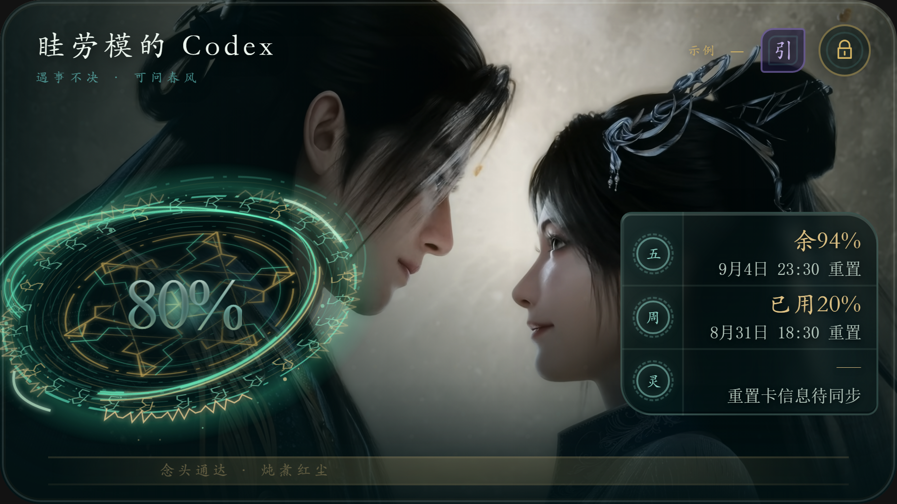

# 凡人额度卡

一款面向 Windows 10/11 的 Codex 与 Antigravity 额度悬浮卡。应用保持在桌面最上层，提供双页额度展示、位置锁定、鼠标穿透、托盘控制和可选开机自启。

### Codex · 大庚剑阵



### Antigravity · 梅凝


> 高清图为 1920 × 1080 的界面结构示意，额度数值会在实际运行时根据本机数据更新。

## 下载与安装

当前版本：**1.0.0**

直接下载仓库中的 [`凡人额度卡-Setup-1.0.0.exe`](artifacts/installer/凡人额度卡-Setup-1.0.0.exe)，双击后按提示安装。安装程序面向当前用户，无需管理员权限，并会创建桌面快捷方式、开始菜单项和卸载入口。

安装包 SHA-256：

```text
5C30ED3108ED07927846481E0695D19A692BD26094B72AB52969C682A9B2E11F
```

运行环境：Windows 10/11 x64，系统需具备 Microsoft Edge WebView2 Runtime。Windows 11 通常已预装。

## 使用方法

- 拖动卡片空白区域可调整位置。
- 点击右上角 **“引”** 在 Codex 与 Antigravity 两页之间切换。
- 点击锁形按钮后，卡片位置被锁定并启用鼠标穿透。
- 按 `Ctrl+Alt+L`，或从系统托盘选择“解锁”，即可恢复操作。
- 托盘菜单可显示或隐藏卡片、锁定或解锁、切换开机自启，以及退出应用。

应用会保存窗口位置和当前页面；每次启动保持解锁，避免窗口锁定后无法操作。高 DPI 屏幕会自动调整原生窗口尺寸，保证整张卡片完整显示。

更详细的操作说明与故障排查见 [使用指南](docs/USER_GUIDE.md)。

## 额度信息如何获取

### Codex

应用优先启动本机 `codex app-server` 子进程，通过标准输入输出进行 JSON-RPC 初始化握手，然后只调用 `account/rateLimits/read`：

- 5 小时额度及重置时间；
- 7 天额度及重置时间；
- 账户余额；
- 可用重置卡数量及最近到期时间。

窗口不依赖接口中的主次顺序，而是按 `windowMinutes=300` 和 `10080` 识别 5 小时与 7 天额度；剩余额度由已用百分比换算。重置卡只统计 `status=available` 的条目，并选取最早到期时间。余额按现有规则以 25 点折合 US$1 显示。

当前卡片的重置时间按 ChatGPT 使用量面板采用的 UTC+9 显示；接口中的 Unix 时间戳保持原值。因此同一时间在 Windows 北京时间（UTC+8）下会早一小时。重置卡需要 `codex app-server` 在启动应用的 Windows 用户环境中取得已登录账户信息；桌面快捷方式从该用户环境启动。仅有本地会话 JSONL 时无法得知重置卡数量。

如果 app-server 超时、鉴权不可用或返回异常，应用会扫描 `%USERPROFILE%\.codex\sessions` 下最近的本地 JSONL 会话，只读取 `token_count.rate_limits` 快照。它最多检查最近 32 个文件末尾各 512 KiB，避免遍历全部聊天内容。回退状态下仍显示能够确认的额度和余额，重置卡信息明确标记为“待同步”。

整个流程只有读取操作，代码中没有调用 `account/rateLimitResetCredit/consume`。

### Antigravity

应用使用 Windows UI Automation，每 60 秒检查 Antigravity 进程及其子进程中已经打开的英文 `Settings - Models` 页面。采集器依据可访问性控件的名称、位置与相邻关系，提取 Available AI Credits、Gemini 与 Claude/GPT 的周额度、5 小时额度和对应重置时间。

采集器只向应用返回白名单字段，不保存完整辅助功能树或原始窗口文字。它不会启动 Antigravity、主动打开设置、切换页面、激活窗口或抢占焦点。

更多字段规则、刷新周期和回退关系见 [数据获取与视觉设计](docs/ARCHITECTURE_AND_DESIGN.md)。

## 视觉设计

### 大庚剑阵与主额度

Codex 页没有使用普通仪表盘。最大额度数字被放进大庚剑阵的阵眼：环形剑纹、符箓轨迹和青金灵光共同围绕 7 天额度运行，让“剩余额度”成为整张卡片的法宝核心。短周期额度、周额度和灵石余额位于右侧阵簿，分别使用“时、周、灵”印记，形成主阵与副印的层级。

背景中的韩立与南宫婉采用相向构图。人物之间的亮部留出呼吸空间，左侧暗部承载剑阵，右侧浅色区域衬托额度面板，使人物关系、世界观氛围和数据可读性同时成立。

### 梅凝与反重力页面

Antigravity 页以梅凝的近景为视觉主体，右侧人物亮部与左侧深墨数据区形成明暗切分。数据排版借鉴修仙卷册和观气仪式：Gemini、Claude 与 GPT 被整理为不同灵脉，周额度和 5 小时额度对应长期修炼与短时运功。

右上角紫色“引”印既是页面入口，也象征引气换境；旁边的锁印负责固定卡片并启用鼠标穿透。两枚印章让桌面操作成为整体世界观的一部分。

## 下一步：可自定义卡片组件

后续版本计划把当前两张固定卡片拆成可组合组件，让用户自由创造自己的额度卡：

- 自定义背景图片、裁切位置、缩放、模糊、遮罩和明暗渐变；
- 自由移动主额度、额度明细、标题、印章、人物与装饰组件；
- 调整字体、字号、颜色、边框、圆角、透明度和层级；
- 选择大庚剑阵、卷轴、灵石、符印等主题组件，也可隐藏任意装饰；
- 保存多套布局方案，并导入、导出主题配置；
- 在编辑模式中拖拽、吸附、预览不同 Windows 缩放比例，退出编辑后继续保持轻量悬浮。

实现上会把“数据源”和“视觉组件”分开：Codex 与 Antigravity 继续提供统一的只读数据，背景、控件位置和样式由独立主题配置驱动。详细的组件边界和分阶段路线见 [数据获取与视觉设计](docs/ARCHITECTURE_AND_DESIGN.md#下一阶段可自定义组件系统)。

## 隐私与网络边界

- 本地服务仅监听随机的 `127.0.0.1` 端口。
- 不读取或保存 Cookie、令牌、邮箱、账号标识、聊天内容和网络流量。
- 不复制 Codex 登录凭据。
- 缓存和设置保存在 `%LOCALAPPDATA%\MortalQuotaCard`。
- 静态服务采用文件白名单，不会对外提供项目源码、配置、缓存或测试文件。

## 从源码运行

安装 Python 3.11 或更高版本后：

```powershell
python -m venv .venv
.\.venv\Scripts\python.exe -m pip install -r requirements-desktop.txt
.\.venv\Scripts\python.exe quota_card_app.py
```

若只需运行浏览器原型：

```powershell
python antigravity_quota.py --port 8765
```

随后打开 `http://127.0.0.1:8765/original-artifact-refined.html`。

## 测试

```powershell
python -m unittest discover -s tests -p "test_*.py" -v
node tests/quota-card-runtime.test.js
node tests/quota-card-formal-v1.test.js
node tests/quota-card-app.test.js
powershell.exe -NoProfile -ExecutionPolicy Bypass -File .\tests\visual-spec.ps1
```

当前正式构建已通过 37 项 Python 测试、3 组 JavaScript 页面测试和视觉规格检查，并在 150% Windows 缩放下验证完整显示、页面切换、锁定与解锁后拖动。

## 构建安装包

```powershell
powershell.exe -NoProfile -ExecutionPolicy Bypass -File .\scripts\build-release.ps1
```

构建脚本会创建隔离环境，使用 PyInstaller 生成目录式应用，再调用 Inno Setup 6 输出当前用户安装包。正式视觉入口由 `scripts/build-formal-v1.py` 从两份已确认概念稿生成，请重新运行构建脚本，不要直接修改生成后的页面。

重新生成两张 1920 × 1080 文档截图：

```powershell
python .\scripts\capture-doc-screenshots.py
```

## 项目结构

```text
mortal_quota/                 Codex 数据读取与 Windows 桌面控制
quota_card_app.py             桌面应用入口
antigravity_quota.py          本地只读服务与 Antigravity 数据读取
scripts/build-formal-v1.py    正式双页卡片生成器
scripts/quota-card-app.js     实时数据绑定与桌面桥接
installer/                    Inno Setup 安装配置
tests/                        Python、JavaScript 与视觉检查
artifacts/installer/          可直接安装的 1.0.0 安装包
```

## 当前范围

1.0.0 不包含自动更新、云同步、重置卡消耗和代码签名。
