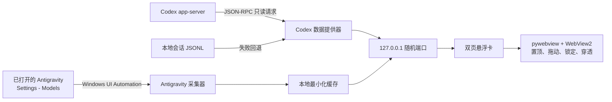

# 凡人额度卡：数据获取、视觉设计与组件化路线

本文说明 1.0.0 如何取得额度数据、两张卡片为何采用当前视觉语言，以及后续如何演进为可以自由编辑的卡片组件系统。

## 数据流总览



桌面应用把数据读取、本地接口、页面渲染和 Windows 窗口控制分开。即使某一数据源暂时不可用，窗口、切页和其他页面仍可继续工作。

## Codex 额度获取

### 首选路径：Codex app-server

`mortal_quota/codex.py` 会启动本机 `codex app-server`，通过标准输入输出发送三条 JSON-RPC 消息：

1. `initialize`：声明客户端为 `mortal-quota-card 1.0.0`；
2. `initialized`：完成初始化通知；
3. `account/rateLimits/read`：读取账户额度、余额和重置卡信息。

读取过程设置 8 秒超时。得到目标响应或发生错误后，子进程会被终止并清理，不会常驻堆积。完整账户结果缓存 60 秒，卡片前端每 15 秒刷新显示，因此频繁重绘不会反复启动 app-server。

程序只实现 `account/rateLimits/read`，没有实现或调用重置卡消耗接口。

### 字段归一化

接口可能把 5 小时和 7 天窗口放在 `primary`、`secondary` 或窗口列表的不同位置。程序不依赖排列顺序，而是依据周期长度分类：

| 周期 | 识别值 |
| --- | ---: |
| 5 小时 | `300` 分钟 |
| 7 天 | `10080` 分钟 |

前端显示的剩余百分比为 `100 - usedPercent`。余额保留接口精度，在界面层按 25 点折合 US$1。最近重置卡到期时间取全部 `status=available` 条目中最早的 `expiresAt`。

数值必须为有限、非负并处于合理范围；无效或缺失数据统一显示“—”或“待同步”，不会沿用概念稿示例值，也不会出现 `NaN`。

### 回退路径：本地 JSONL

app-server 不可用时，程序读取 `%USERPROFILE%\.codex\sessions` 中的本地会话事件：

- 只检查按修改时间排序的最近 32 个 JSONL 文件；
- 每个文件最多读取末尾 512 KiB；
- 只解析 `payload.type=token_count` 下的 `rate_limits`；
- 从最新有效事件中恢复额度、余额和套餐类型；
- 超过 10 分钟的快照标记为 `stale`。

本地会话不包含完整重置卡明细，因此回退时明确显示“重置卡信息待同步”。该路径不会复制登录凭据，也不会把聊天文本送入页面。

## Antigravity 额度获取

Antigravity 暂无本项目可直接调用的稳定账户接口，因此 1.0.0 使用 Windows UI Automation 只读提取用户已经打开的英文 `Settings - Models` 页面。

采集器首先定位 Antigravity 主进程及其子进程，再读取对应窗口的可访问性控件。解析过程同时参考控件文本、屏幕位置和附近控件，避免把其他区域的数字误判为额度。

允许输出的字段只有：

- Available AI Credits；
- Gemini 周剩余、5 小时剩余及重置时间；
- Claude/GPT 周剩余、5 小时剩余及重置时间；
- 同步状态和时间。

百分比只接受 0–100 的完整非负整数；灵石余额只接受合理范围内的非负整数。采集结果不会包含窗口标题全集、完整辅助功能树、账号标识或其他页面文字。

轮询周期为 60 秒。页面暂时不存在时保留最近成功值并显示待同步；10 分钟后标记滞后，24 小时后隐藏过期百分比。

## 本地服务和桌面壳

Python 服务绑定 `127.0.0.1` 的随机端口，只暴露：

- `GET /api/codex-quota`；
- `GET /api/antigravity-quota`；
- 卡片运行所需的白名单 HTML、CSS、JavaScript 和图片。

pywebview 使用 WebView2 渲染卡片。Windows 原生层负责始终置顶、按 DPI 修正客户区尺寸、无边框圆角、位置恢复、单实例、托盘、全局解锁快捷键和鼠标穿透。

## 视觉设计巧思

### Codex：大庚剑阵作为额度仪表

主额度没有采用常见的进度条或半圆仪表，而是成为大庚剑阵的“阵眼”。大数字置于阵法中心，外围的剑纹、符箓、轨道、粒子与灵光共同表达额度的流动和消耗。

7 天额度决定长期可用空间，因此占据最大的视觉面积；5 小时额度属于短周期状态，被收进右侧“时”印。周额度与余额分别使用“周”“灵”印，像阵簿中的三条记录。这样的层级使用户一眼看到最重要的信息，同时保留精确重置时间。

色彩以青玉、墨绿和淡金为主。青玉表示灵力与可用状态，淡金负责数字和关键边线，危险状态才逐步转向暖金与赤色。

### 韩立与南宫婉：人物关系形成信息结构

Codex 背景采用韩立与南宫婉相向的画面。韩立位于左侧深色区域，与大庚剑阵叠合；南宫婉位于右侧亮部，人物之间的留白让画面有呼吸感。

数据面板落在右下深色衣纹区域，通过半透明墨色底板获得可读性。阵法、人物和数据分别占据不同视觉层，不需要牺牲人物主体来换取信息密度。

### Antigravity：梅凝与观气卷册

反重力页面以梅凝近景作为视觉主体。人物面部集中在右侧，左侧使用深墨渐变承载模型额度；这种强烈明暗切分呼应 Antigravity 的科技感，也延续修仙世界中的幽玄气质。

Gemini、Claude 与 GPT 被视为不同灵脉。周额度与 5 小时额度像修炼周期和短时运功，横向金线则像卷册分栏。右侧纵排“灵枢·观气”强化了查看灵力余量的仪式感。

### “引”印和锁印

紫色“引”印是两个世界之间的切换入口。“引”既表示引气，也表示引导到另一页；紫色把它与主卡的青金体系区分开，让用户能快速找到入口。

锁印负责固定位置和鼠标穿透。它与“引”印共同位于右上角，形成稳定的操作区，同时从拖动热区中排除，避免移动窗口时误触。

## 下一阶段：可自定义组件系统

目标是保留稳定的数据能力，把当前固定页面变成可组合、可保存、可分享的视觉卡片。

### 组件拆分

计划把页面拆成独立组件：

| 组件 | 可配置内容 |
| --- | --- |
| 背景 | 本地图片、裁切、缩放、焦点、模糊、亮度、遮罩 |
| 主额度 | 数据字段、数字格式、阵法/仪表外观、尺寸与位置 |
| 明细行 | 图标、标签、百分比、重置时间、排列方向 |
| 标题与题词 | 文案、字体、字距、颜色、方向 |
| 装饰 | 剑阵、符箓、粒子、边框、印章、渐变 |
| 桌面控件 | 切页、锁定、透明度、交互安全区 |

每个组件都拥有 `x`、`y`、`width`、`height`、`zIndex`、`visible` 和样式参数。数据组件额外声明绑定字段，例如 `codex.weekly.remainingPercent`。

### 编辑体验

编辑模式将提供：

1. 直接拖动和缩放组件；
2. 网格、参考线、边缘吸附和安全区；
3. 图层排序、锁定图层、复制和隐藏；
4. 背景焦点与遮罩实时预览；
5. 100%、125%、150% Windows 缩放预览；
6. 撤销、重做和恢复默认主题。

退出编辑模式后，页面只加载最终布局和必要动画，不保留编辑器开销。

### 主题配置

布局保存为版本化 JSON，不把账户额度写进主题文件。一个主题只描述视觉和字段绑定，因此可以在不同电脑或不同账号之间安全复用。

```json
{
  "schemaVersion": 1,
  "canvas": { "width": 480, "height": 270 },
  "background": {
    "source": "user://backgrounds/my-scene.png",
    "position": "52% 45%",
    "overlay": "linear-gradient(90deg, #061713ee, transparent)"
  },
  "components": [
    {
      "type": "quotaFormation",
      "binding": "codex.weekly.remainingPercent",
      "x": 16,
      "y": 82,
      "width": 220,
      "height": 150
    }
  ]
}
```

自定义背景只保存在本机应用数据目录。导出主题时可选择只导出配置，或把用户明确选择的图片打包进去。

### 分阶段实现

1. 把现有两页拆成数据绑定组件与主题变量，视觉保持不变；
2. 增加主题 JSON 读取、校验、保存和恢复默认值；
3. 增加背景选择与基础位置编辑；
4. 增加完整画布编辑器、图层系统与布局导入导出；
5. 建立主题模板库，让用户在现有大庚剑阵和梅凝主题上继续创作。

整个演进过程中，额度采集继续保持只读，主题系统不会获得账户接口或重置卡操作权限。

## 高清截图

仓库内提供两张 1920 × 1080 PNG：

- `docs/images/mortal-quota-card-codex-hd.png`；
- `docs/images/mortal-quota-card-antigravity-hd.png`。

运行以下命令可从当前正式页面重新生成：

```powershell
python .\scripts\capture-doc-screenshots.py
```

截图采用 4 倍设备缩放渲染，适合放在 README、项目介绍或演示文档中。图中额度仅用于说明界面结构，实际数值以应用实时读取结果为准。
