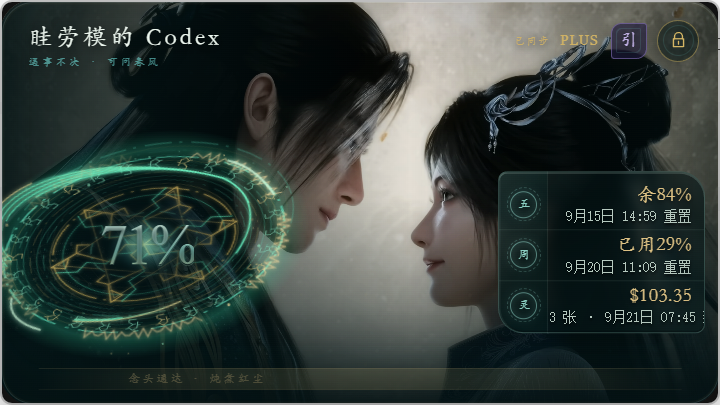

# 凡人额度卡使用指南

## 界面说明



右上角有两个主要控件：

1. **引**：在 Codex 与 Antigravity 页面之间切换。
2. **锁**：锁定当前窗口位置，同时让鼠标点击穿透卡片。

卡片会根据 Windows 显示缩放自动调整实际窗口尺寸，因此在 100%、125%、150% 等缩放下都应完整显示，不会裁掉右侧数据或底部边框。

## Codex 页面

Codex 页面显示 5 小时额度、7 天额度、余额和重置卡信息。数据优先来自本机 Codex 的只读账户接口。

常见状态：

| 状态 | 含义 |
| --- | --- |
| 正常显示百分比和时间 | 已取得最新数据 |
| `—` | 当前字段没有可靠数据 |
| `待同步` | 完整账户信息暂时不可用，正在使用可确认的本地数据 |

## Antigravity 页面

要同步 Antigravity 额度，请先：

1. 启动 Antigravity IDE。
2. 打开英文界面的 `Settings - Models` 页面。
3. 保持该页面存在，额度卡会在一分钟内只读同步。

页面没有打开时，应用保留最近一次成功值并显示状态；超过 10 分钟未更新会提示同步滞后，超过 24 小时会隐藏过期百分比并提示重新打开 Models 页面。

## 移动与锁定

解锁状态下，按住卡片空白区域并拖动即可移动。右上角两个按钮区域不会触发拖动，便于切页和锁定。

锁定后，鼠标操作会穿过卡片传递到下方窗口。可用以下任一方法解锁：

- 按 `Ctrl+Alt+L`；
- 右击系统托盘中的“凡人额度卡”，选择“解锁”。

锁定状态不会跨启动保存。即使上次退出时处于锁定状态，下次启动也可以直接操作。

## 托盘菜单

| 菜单项 | 作用 |
| --- | --- |
| 显示/隐藏 | 切换卡片可见状态 |
| 锁定/解锁 | 控制位置锁定与鼠标穿透 |
| 开机自启 | 为当前 Windows 用户启用或关闭自动启动 |
| 退出 | 结束应用并清理托盘、快捷键和本地服务 |

应用采用单实例运行。再次启动快捷方式时，只会显示已经运行的窗口。

## 故障排查

### 卡片被锁定后无法点击

按 `Ctrl+Alt+L` 解锁。如果快捷键被其他程序占用，从系统托盘菜单选择“解锁”。

### Antigravity 一直显示待同步

确认 Antigravity 已打开英文 `Settings - Models` 页面。应用不会自行打开或切换该页面。

### Codex 重置卡显示待同步

这通常表示完整账户接口暂时不可用，应用已回退到本地会话数据。Codex 额度和余额仍会显示能够确认的值；重新登录或重启 Codex 后，应用会自动再次尝试只读同步。

### 卡片位置跑到屏幕外

重新启动应用。启动时会检查当前显示器工作区，并将超出屏幕的窗口移回可见范围。

### 完全退出应用

关闭卡片并不等于结束后台托盘进程。需要在托盘菜单中选择“退出”。

## 本地文件

用户设置和缓存目录：

```text
%LOCALAPPDATA%\MortalQuotaCard
```

卸载应用不会改变 Codex 或 Antigravity 的账户数据。
